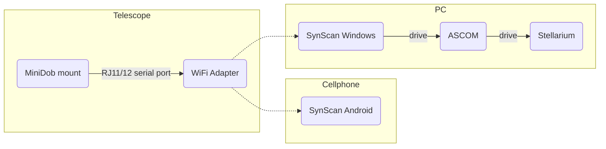

This post is to illustrate how to computerize the Skywatcher Virtuoso miniDob mount. Assembled and tested in July 2021. Some interesting discussions on the proper way to computerize it can be found in this [discussion](https://stargazerslounge.com/topic/239925-skywatcher-heritage-virtuoso-controlled-via-bluetooth/). Note: since everyone's expectations and budgets may largely differ, no comment will be made here on whether the mount discussed is a rational choice. 

# Background information
The [Skywatcher Virtuoso miniDob mount](https://www.skywatcherusa.com/products/sky-watcher-virtuoso) is a single-arm, alt-azimuth mount sold with a 90mm Maksutov-Cassegrain telescope or a 114mm Newtonian telescope since 2014. Now the price of a used one is typically around £200. It can be driven by built-in motors or by hands. The clutches ensure the manually pushed rotations are tracked and recorded as motor-driven motivations. The mount has already been computerized with a relatively simple program - auto-tracking is utilized if the true North and geographic latitude is set correctly. Besides, it can also cruise along a pre-set path. The [official manual](https://cdn.shopify.com/s/files/1/0080/7095/5123/files/S11750_Virtuoso.pdf) in PDF version is available online. 

Available connectors or ports for extensions are listed below:

* A dovetail slot for common telescopes;  
* A **3/8"** thread for common camera tripods locates at the bottom of the AZ clutch;  
* An L-shape adaptor and an attached adaptor with **1/4"** threads for common cameras;  
* A RJ11/12 serial port for communication;  
* A 12V 2A 5.5\*3mm DC port for external power supply;  
* A snap cable port for Canon cameras.  

# Setup

The setup for the complete computerization of the miniDob mount is illustrated in the flow chart below. 

## Setup the connection
To utilize the computerization, the official solution is adopted to avoid unnecessary troubles. In fact, non-official WiFi/Bluetooth solutions are not noticeably competitive in costs. For the official solution, two critical parts are required: 

* [SynScan WiFi adaptor](http://skywatcher.com/product/synscan-wi-fi-adapter/), plugged into the RJ11/12 serial port for wireless communication;  
*  [SynScan App](https://www.skywatcher.com/download/software/synscan-app/), installed on your computer or cellphone (Android only) for connection to the mount.   

*Step 1* Plug the WiFi adaptor into the RJ11/12 serial port and turn on the switch. 

{: w="400" h="156"}

*Step 2* Search available WiFi connection and connect your device to the WiFi spot named as 'SynScan_WiFi_*'. By doing this the connected device will lose the Internet connection.

{: w="400" h="228"}

{: w="400" h="328"}

*Step 3* Launch the Synscan App, click on the 'Connect' button on the top of the window, select the available port and setup the connection. For PC users, probably no location sensor is available, so setting the latitude, longitude, and altitude manually is required. The panel can be found in 'Settings/Location/'. 

After setting up the connection, the laptop or cellphone can already function as a hand controller for GOTO via SynScan App. For cellphone users, that is the end of story due to the limited choice of applications. For personal computer (PC) users, it is possible to track and control the current field of view (FoV) in the realistic sky via [Stellarium](https://stellarium.org/). 

## Live tracking via Stellarium PLUS on Android
**Update 21/01/21, Not tested**

Noticed in the new edition of [Stellarium PLUS app](https://www.stellarium-labs.com/telescope-control-in-stellarium-mobile-plus/), direct connection to SynScan Android is achieved. Will test that when I decide to buy that App (￡14.99) - Not an economic choice considering its price and features. [Mobile observatory 3 Pro](https://play.google.com/store/apps/details?id=com.zima.mobileobservatorypro&hl=en_US&gl=US) is a more rational choice, but no telescope control port is provided.  

## Live tracking on personal computers
It is possible to achieve the live tracking of the telescope FoV on personal computers. Two software should be installed: 

1. [ASCOM](https://www.ascom-standards.org/), the platform bridge between the SynScan driver and the virtual planetarium software;  
2. [ASCOM driver for SynScan APP](http://www.skywatcher.com/download/software/ascom-driver/), to connect SynScan APP to ASCOM device hub;
3. [Stellarium](https://stellarium.org/), a virtual planetarium supporting ASCOM.  

{: w="600" h="341"}

*Step 1* Make sure the driver has been correctly installed. Open 'ASCOM Device Hub', click 'Tools' and select 'Setup'. 

*Step 2* From the pop-out window, select the 'Telescope Setup' tab. 

*Step 3* Click on the 'Choose' button. From the pull-down menu, select 'SynScan App Driver' and click OK. For properties, the default settings are okay. 

*Step 4* Go back to the initial panel, click on the button 'Connect Telescope' and wait for the software to setup the connection. 

*Step 5* After the connection to ASCOM successfully set, launch Stellarium. Click 'Configuration window' on the left and go ['Plug-ins/Telescope Control'](http://stellarium.sourceforge.net/wiki/index.php/Telescope_Control_plug-in). Tick 'Load at startup' and restart Stellarium.

*Step 6* Following the same path as the previous step, click 'configure'. From the pop-out window select 'add a new telescope'.

{: w="500" h="456"}

{: w="500" h="390"}

*Step 7* In the 'Telescope controlled by' panel, select the 'ASCOM' option. Provide a proper name of the telescope in the 'Telescope properties' panel. Choose 'SynScan App Driver' from the pull-down menu of 'Choose ASCOM Telescope'. Click 'OK'.

{: w="400" h="360"}

*Step 8* Return to the 'config' panel. Select the telescope just created from the list and click 'Connect'.

{: w="600" h="336"}

*Step 9* Return to the home screen. There will be a circle with name of the newly created telescope showing its live FoV. 

## Usage & keybindings of Stellarium telescope control plug-in
The circle indicating the current aim will automatically track movements of the mount. The following keybindings are used to control the telescope via Stellarium. 

* `Ctrl + [x]` Automatically aim the telescope \[x\] to the selected celestial body. \[x\] is the ID number of the telescope. Check the first column of telescopes list (Step 8). For example, to control 'Skywatcher Mak 90', press `Ctrl 1`.  

* `Alt + [x]` Aim the telescope \[x\] to the center of the screen.  

# Other options
## Hand controller
The most direct way to computerize the mount. However, it is also the most expensive option. Considering the conditions of field observations, especially in winters, its robustness makes it worth that price. 

Only the old version, [SynScan V3 hand controller](https://www.skywatcher.com/download/software/synscan-v3-hand-controller-firmware/), is supported. Price for used ones varies, typically \~￡120.   

## Wired connection
Connecting to the telescope mount via a serial-to-USB cable is possible and cheaper. However, its flexibility will be influenced. Besides, such connection is currently known to support Windows PC only. Another issue is that the tested [serial-to-USB cable](https://teleskopy.pl/product_info.php?currency=EUR&products_id=3376&language=en&lunety=Przew%C3%B3d_kabel_USB_do_SkyWatcher_Virtuoso,_d%C2%B3ugo%C2%B6%C3%A6_2_metry) with the PL2303 chip is no longer available any more. The alternative with the FT232RL chip currently on the market does not fit the mount according to my test in July 2021. 

If, by any chance, the wired connection is set up properly, the driver, [AZ GOTO do Armazém](https://sourceforge.net/projects/driverazgoto/) should be installed to make ASCOM recognize the mount and setup the connection to Stellarium, in a similar fashion to the SynScan driver. 

## Other software
Stellarium is currently the most widely-supported and well-maintained virtual planetarium on Windows. Another software, [Cartes du Ciel](https://astronomytechnologytoday.com/2019/10/28/cartes-du-ciel/) is also [tested effective](https://www.youtube.com/watch?v=r23mG2xPiBU&t=56s) for both wireless and wired connections. 
